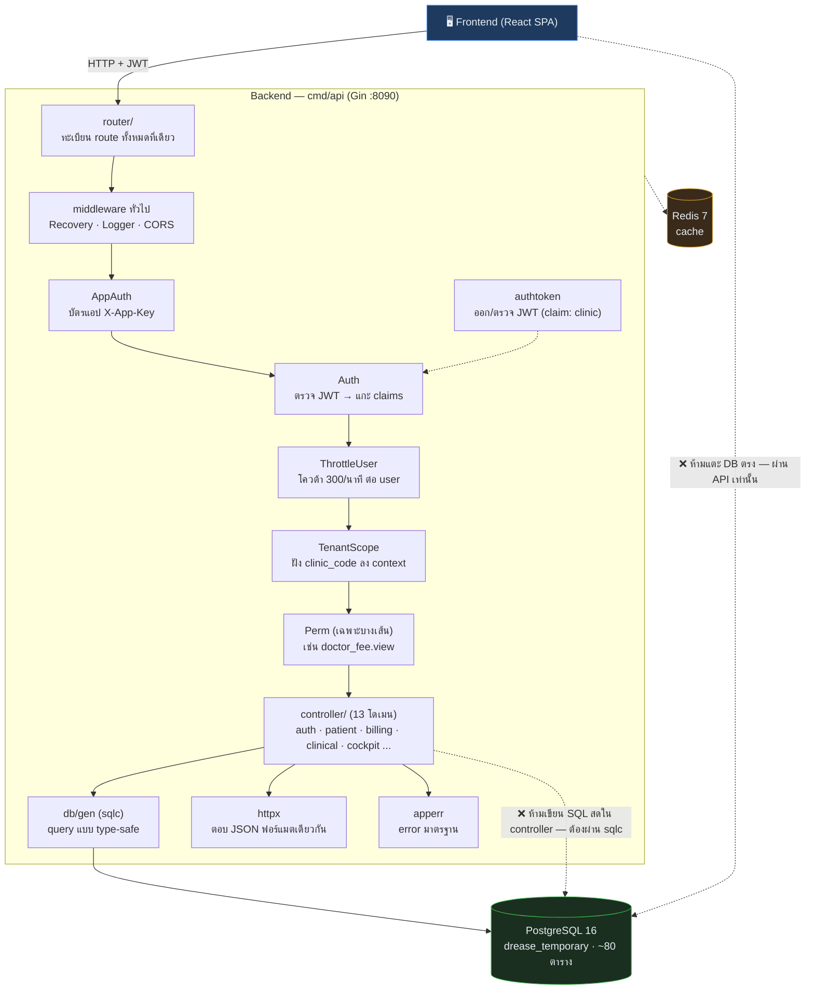

# Backend — โครงสร้างเชิงลึก (Go)

เอกสารนี้อธิบายโครงสร้างภายในของ `drease-v4-backend` ให้คนที่ดู control repo เข้าใจว่าหลังบ้านวางโครงยังไง ทำงานทีละขั้นยังไง และมีตารางฐานข้อมูลอะไรบ้าง — สำหรับรายการ endpoint ดู [API-CONTRACT.md](API-CONTRACT.md)

_อัปเดตล่าสุด: 2026-06-11 — อิงโค้ดที่ commit `3a9f333` (`feat/auth-complete` — auth สองชั้น X-App-Key + JWT + rate limit + CORS allow X-App-Key, PR #2)_

## Stack

| ส่วน | ใช้อะไร |
|---|---|
| ภาษา / Framework | Go 1.25 + Gin |
| Database | PostgreSQL 16 (ผ่าน pgx v5) — DB ชื่อ `drease_temporary` |
| Cache | Redis 7 |
| Migration | golang-migrate — 39 migrations (รันอัตโนมัติตอน `docker compose up`) |
| Query layer | sqlc — เขียน SQL ใน `internal/db/query` → generate Go ไป `internal/db/gen` |
| Auth | สองชั้น: `X-App-Key` (บัตรแอป — env `APP_KEYS`, แอปละ key) + JWT (บัตรคน — claims: user id, email, name, **clinic**) |
| Rate limit | fixed-window in-memory: เดารหัส 10/นาที/IP · public 120/นาที/IP · authed 300/นาที/user |

## โครงสร้างโฟลเดอร์

```
cmd/api/main.go      จุดเริ่มโปรแกรม — ประกอบทุกอย่างแล้วสตาร์ท server
internal/
  router/            ทะเบียน route ทั้งหมดไว้ที่เดียว (router.go ไฟล์เดียว ตั้งใจให้เห็นแผนที่ API ครบ)
  controller/        แยกตามโดเมน 13 ตัว: auth, patient, appointment, billing, clinical,
                     cockpit, course, deposit, doctorfee, recall, stock, telemetry, health
  middleware/        Recovery, Logger, CORS, AppAuth (X-App-Key), Auth (JWT),
                     Throttle (ต่อ IP) + ThrottleUser (ต่อ user), TenantScope, Perm
  authtoken/         ออก/ตรวจ JWT — payload มี ClinicCode (claim "clinic")
  db/                migrations/ + query/ (SQL ต้นฉบับ) + gen/ (โค้ดที่ sqlc สร้าง) + pool.go
  apperr/            มาตรฐาน error ของทั้งระบบ
  httpx/             ตัวช่วยตอบ JSON ให้ฟอร์แมตเดียวกันทุกเส้น
  pgkit/             ตัวช่วยแปลงชนิดข้อมูล Postgres
  config/            อ่านค่า env (.env)
```

## การทำงานทีละขั้นตอน (request flow)



อธิบายแต่ละขั้น:

```
1) Request เข้า Gin
2) Recovery → Logger → CORS          (middleware ทั่วไป: กัน panic, จด log, อนุญาต cross-origin)
3) AppAuth                           เช็คบัตรแอป X-App-Key กับทะเบียน APP_KEYS (ช่วง rollout = log-only)
4) Auth                              ตรวจ JWT จาก header — แกะ claims ออกมา (ใคร, คลินิกไหน)
5) ThrottleUser                      โควต้า 300/นาที นับที่ตัว user จาก token (ไม่ใช่ IP) — เกิน = 429
6) TenantScope                       ดึง clinic_code จาก claim ฝังไว้ใน context
                                     → ทุก query หลังจากนี้เห็นเฉพาะข้อมูลคลินิกตัวเอง
7) Perm (เฉพาะบางเส้น)               ตรวจสิทธิ์ เช่น doctor_fee.view / doctor_fee.edit
8) Controller                        รับ request → validate → เรียก query
9) sqlc query (internal/db/gen)      คุย PostgreSQL แบบ type-safe
10) ตอบกลับผ่าน httpx                 JSON ฟอร์แมตเดียวกัน / ผิดพลาดผ่าน apperr
```

จุดที่ควรรู้:
- **Tenant isolation (ใหม่):** migration 0039 เพิ่ม `clinic_code` + index ให้ตารางข้อมูลคลินิกทุกตัว (backfill จาก `branch_code` เดิม) — เป้าหมายคือหลายคลินิกใช้ DB เดียวกันโดยมองไม่เห็นข้อมูลกันข้ามคลินิก
- **Auth สองชั้น (ใหม่):** ทุกเส้นมีบัตรอย่างน้อย 1 ใบ — Route แบ่ง 4 เลน:
  - เลน 0 infra: `/`, `/healthz` — เปิด (health check ส่ง header ไม่ได้)
  - เลน 1 signed-link: ลิงก์จากอีเมล/LINE (`/appointment_confirm/*`, ฟอร์ม reset) — auth ฝังใน URL + throttle IP
  - เลน 2 public API: login, password reset, OTP, จองคิวข้ามเว็บ, error-log — บัตรแอป `X-App-Key` + throttle IP (กลุ่มเดารหัสแชร์โควต้าเข้ม 10/นาที)
  - เลน 3 authed: `/v3/*` + `/api/*` — สองบัตร (`X-App-Key` + JWT) + ThrottleUser 300/นาที/user + TenantScope
- Rollout: `APP_AUTH_ENFORCE=false` (log-only — log `APPAUTH missing key` แต่ยังให้ผ่าน) จนกว่า frontend จะแนบ header ครบ แล้วค่อยเปิด `true`; `AUTH_ENFORCE` คุมชั้น JWT แบบเดียวกัน

## ตารางฐานข้อมูลทั้งหมด (~80 ตาราง จาก 39 migrations)

### ผู้ใช้ / สิทธิ์ / Auth
| ตาราง | หน้าที่ |
|---|---|
| `users`, `sessions`, `password_resets` | บัญชีผู้ใช้ + session + รีเซ็ตรหัส |
| `role_presets`, `user_roles`, `preview_sessions` | บทบาทและสิทธิ์ (ใช้กับ middleware Perm) |
| `otp_codes` | OTP สำหรับ consent |

### คนไข้ / คลินิก / นัดหมาย
| ตาราง | หน้าที่ |
|---|---|
| `patient`, `doctor`, `clinic` | ข้อมูลหลักคนไข้-หมอ-คลินิก (มี `clinic_code` แล้ว) |
| `appointment`, `clinic_appointment` | นัดหมาย |
| `queue_log` | คิว OPD (kanban หน้า queue) |
| `walkin_counter` | นับ walk-in รายวัน |
| `bookease_event`, `bookease_booking` | จองคิวจากระบบ BookEase ภายนอก |

### เวชระเบียน / คลินิกอล
| ตาราง | หน้าที่ |
|---|---|
| `patient_history`, `patient_diag`, `patient_allergy` | ประวัติ, การวินิจฉัย (OPD/SOAP), แพ้ยา |
| `prescription`, `prescription_item`, `drug`, `icd10` | ใบสั่งยา + ทะเบียนยา + รหัสโรค |
| `lab_order`, `lab_result` | สั่งแล็บ + ผล |
| `treatment_plan`, `treatment_plan_step` | แผนการรักษา |
| `tooth_chart`, `tooth_status` | งานทันตกรรม |
| `tcm_assessment`, `herbal_formula`, `herbal_ingredient` | แพทย์แผนจีน |
| `rehab_assessment`, `rehab_assessment_score` | กายภาพ |
| `clinical_template`, `clinic_template_instance` | template บันทึกตรวจ |
| `attachments`, `photos` | ไฟล์แนบ + รูปก่อน/หลัง |
| `insurance_claim` | เคลมประกัน |
| `patient_consents`, `clinic_consents`, `bill_consents`, `pdpa_consents` | ใบยินยอม + PDPA |

### การเงิน / POS / บิล
| ตาราง | หน้าที่ |
|---|---|
| `bills`, `bills_summary`, `node_bill` | บิลหลัก (ของเดิม v2 + ที่ย้ายจาก Node) |
| `bill_idempotency`, `sales_intent`, `bill_voids` | กันจ่ายซ้ำ, intent ก่อนจ่าย, ยกเลิกบิล |
| `customer_deposits`, `deposit_transactions`, `deposit_policy` | ระบบมัดจำ |
| `edc_provider`, `edc_terminal`, `edc_method`, `edc_session`, `edc_void_log` | เครื่องรูดบัตร/QR (EDC) |
| `shift_close` | ปิดกะเงินสด |
| `doctor_fee_rules`, `doctor_fee_audit`, `bill_doctor_fees`, `sales_commission_rules` | ค่ามือแพทย์ + คอมมิชชั่น |
| `discount_setting`, `print_setting` | ตั้งค่าส่วนลด/ใบเสร็จ |
| `clinic_subscription`, `billing_invoice`, `payment_method` | ค่าบริการระบบ (subscription ของคลินิกกับ Drease) |

### สต๊อก / คอร์ส
| ตาราง | หน้าที่ |
|---|---|
| `stock_item`, `slot_stock`, `pos_stock_items` | คลังยา-เวชภัณฑ์ |
| `stock_movement` | เดินสต๊อกเข้า-ออก (ledger) |
| `course_item`, `course_usage`, `course_usage_ledger` | คอร์ส + การตัดใช้ |

### ระบบ / AI / อื่น ๆ
| ตาราง | หน้าที่ |
|---|---|
| `error_log` | รับ error จาก frontend (`POST /v3/error-log`) |
| `ai_log`, `ai_call`, `custom_report` | งาน AI + รายงานที่ผู้ใช้สร้างเอง |
| `feedback_events` | เก็บ feedback การใช้งาน |
| `onboarding_state` | สถานะการตั้งค่าคลินิกใหม่ |

### เส้นทาง migration (ไล่ตามลำดับ)

- `0001–0004` ฐานราก: users, password_resets, appointment, sessions
- `0005–0033` ยกระบบ v3 มาทีละโดเมน: POS → สต๊อก/คอร์ส → EDC → error log → AI → subscription → คลินิกอล → ICD10/ยา → doctor fee → permissions → เอกสาร/consent → มัดจำ → ปิดกะ → BookEase → walk-in → รูป → template
- `0034–0035` ดึงตารางแกนจาก v2 (bills, patient, doctor, clinic) และจาก Mongo (stock, course, node_bill) เข้า Postgres เดียวกัน
- `0036–0038` เติมคอลัมน์ที่หน้า cockpit/clinical ต้องใช้
- `0039` **tenant isolation** — เพิ่ม `clinic_code` ทุกตารางคลินิก + ผูก users กับคลินิก

## รันยังไง

```bash
cd drease-v4-backend
docker compose up
# ได้ครบ: PostgreSQL 16 (:5432) + Redis 7 (:6379) + migrate (รัน 39 migrations อัตโนมัติ) + API (:8090)
# เช็คว่าขึ้น: http://localhost:8090/healthz
```
