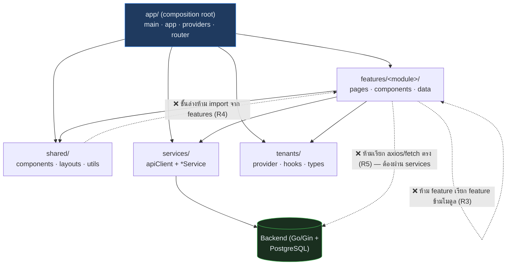

# Frontend — โครงสร้างเชิงลึก (React)

เอกสารนี้อธิบายโครงสร้างภายในของ `drease-v4-frontend` ให้คนที่ดู control repo เข้าใจว่าหน้าบ้านวางโครงยังไง หน้าหนึ่ง ๆ ทำงานทีละขั้นยังไง และกฎสถาปัตยกรรมที่ linter บังคับอยู่ — คู่กันกับ [BACKEND.md](BACKEND.md) ฝั่งหลังบ้าน

_อัปเดตล่าสุด: 2026-06-11 — งานหลักอยู่ branch `frontend/react-spa-scaffold` (master ตามอยู่ที่ merge ล่าสุด)_

## Stack

| ส่วน | ใช้อะไร |
|---|---|
| ภาษา / Framework | React 19 + TypeScript + Vite |
| Routing | React Router 7 (SPA — เปลี่ยนหน้าไม่โหลดใหม่) |
| เรียก API | axios ผ่าน `apiClient` ตัวเดียว (แนบ JWT อัตโนมัติ) |
| UI เสริม | Chart.js (กราฟรายงาน), FullCalendar (ตารางนัด) |
| Test / Lint | Vitest + Testing Library, ESLint บังคับกฎสถาปัตยกรรม (architecture linter) |
| Multi-tenant | tenant layer — config ต่อคลินิก + เปิด/ปิดฟีเจอร์รายคลินิก |

## โครงสร้าง 5 ชั้น

```
src/
  app/        composition root — main, app shell, providers, router (ทะเบียนทุกหน้า)
  features/   16 โมดูลแยกตามงาน — แต่ละโมดูลมี pages + components + data ของตัวเอง
  shared/     ของกลางที่ทุก feature ใช้ได้: components, layouts, utils
  services/   ตัวเดียวที่คุย backend: apiClient + authService + patientService + ...
  tenants/    ค่าเฉพาะคลินิก: TenantProvider, useTenant, IfFeature (เปิด/ปิดฟีเจอร์รายคลินิก)
```



## Features ทั้ง 16 โมดูล

| โมดูล | หน้าที่ | โมดูล | หน้าที่ |
|---|---|---|---|
| `auth` | หน้า login | `cockpit` | dashboard หลัก + AI bar |
| `customers` | รายชื่อ/ค้นหาคนไข้ + AI recommend | `queue` | คิว OPD แบบ kanban |
| `opd` | SOAP note / บันทึกตรวจ | `prescription` | สั่งยา + เช็คแพ้ยา |
| `appointments` | ปฏิทินนัด + เพิ่มนัด modal | `recall` | ตามคนไข้กลับมา (scene cards) |
| `checkout` | คิดเงิน POS | `bills` | ประวัติการชำระ |
| `invoice` | ใบแจ้งหนี้ (print) | `receipt` | ใบเสร็จ (print) |
| `courses` | คอร์ส | `inventory` | สต๊อกยา/เวชภัณฑ์ |
| `certificate` | ใบรับรองแพทย์ | `reports` | ศูนย์รายงาน + รายงานย่อย 8 หน้า |

## การทำงานทีละขั้นตอน (เปิดหน้า → ข้อมูลขึ้นจอ)

ตัวอย่าง: คุณนิดเปิดหน้า "ค้นหาคนไข้"

```
1) คลิกเมนู                      React Router (app/router.tsx) สลับไป CustomersPage
                                 — ไม่โหลดหน้าใหม่ เพราะเป็น SPA
2) TenantProvider ครอบอยู่แล้ว    หน้านี้รู้ config คลินิกตัวเอง (ชื่อ, ธีม, ฟีเจอร์ที่เปิด)
                                 ฟีเจอร์ที่คลินิกนี้ไม่ได้ซื้อ ถูกซ่อนด้วย <IfFeature>
3) CustomersPage เรียก service    patientService.search("สมหญิง") — หน้าห้ามยิง axios เอง
4) apiClient แนบบัตรให้           interceptor ใส่ Authorization: Bearer <token> อัตโนมัติ
                                 (อนาคต: แนบ X-App-Key ด้วย — ดู API-FLOW.md)
5) Backend ตอบ JSON              เฉพาะคนไข้คลินิกตัวเอง (TenantScope ฝั่งหลังบ้านกรองให้)
6) React render                  ผลขึ้นจอ — state อยู่ในหน้านั้น ไม่มี global store
```

## กฎสถาปัตยกรรม (ESLint บังคับจริง commit ไม่ผ่านถ้าฝืน)

| กฎ | ห้ามอะไร | เพื่ออะไร |
|---|---|---|
| R3 | feature import ข้าม feature (`recall` ห้ามดึงของจาก `reports`) | แต่ละโมดูลแก้/ลบได้โดยไม่พังเพื่อน — ของที่ใช้ร่วมต้องย้ายไป `shared/` |
| R4 | ชั้นล่าง (`shared/`, `services/`, `tenants/`) import จาก `features/` | ทิศทางพึ่งพาไหลลงทางเดียว ไม่มีวงกลม |
| R5 | เรียก `axios`/`fetch` ตรงใน feature | บังคับให้ทุกการคุย backend ผ่าน `services/` — แนบ token/จัดการ error ที่เดียว |
| R6.4 | relative import ไต่ขึ้นข้ามชั้น (`../../..`) | ใช้ alias `@/` เสมอ อ่านแล้วรู้ทันทีว่ามาจากชั้นไหน |

## สถานะการต่อ API จริง

หน้าเกือบทั้งหมดยังใช้ **demo data** ใน `features/*/data.ts` — ต่อ API จริงแล้ว 4 จุด: ค้นหาคนไข้, service catalog หน้า checkout, live revenue หน้า cockpit, customer search ใน modal เพิ่มนัด — ดูรายเส้นที่ [API-CONTRACT.md](API-CONTRACT.md) และสถานะงานทั้งหมดที่ [TASKS.md](TASKS.md)

> 📌 เอกสารฉบับลึกของทีม frontend เอง (ภาษาอังกฤษ มาตรฐานการเพิ่มโมดูล ฯลฯ) อยู่ใน repo frontend: `FRONTEND.md`
