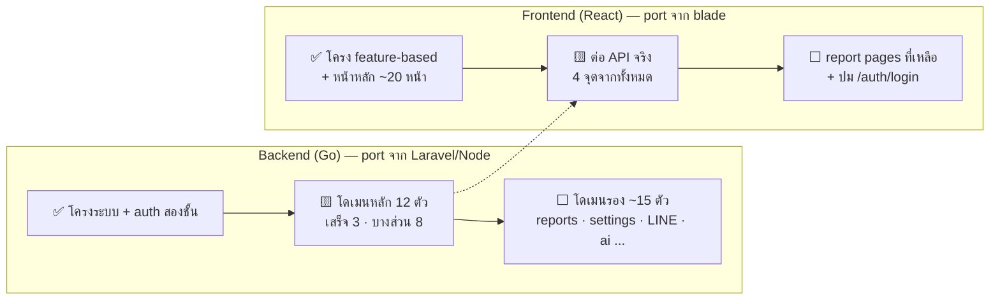

# Tasks — สถานะงานทั้งระบบ

สรุปว่าตอนนี้อะไร**เสร็จแล้ว / ทำอยู่ / ยังไม่เริ่ม** ทั้ง backend และ frontend — รวบรวมจากของจริง: `.kiro/specs/*/tasks.md` ของทั้งสอง repo, `router.go`, โค้ดที่มีอยู่จริง และ git log

_อัปเดตล่าสุด: 2026-06-11 — backend @`7abe1e9` (master), frontend @`e5a2723` (master) / งานสดอยู่ branch `frontend/react-spa-scaffold`_

สถานะ: ✅ เสร็จ | 🟨 เสร็จบางส่วน | ⬜ ยังไม่เริ่ม

## ภาพรวม

## 🏗️ โครงสร้างพื้นฐาน (เสร็จหมดแล้ว)

| งาน | สถานะ | หมายเหตุ |
|---|---|---|
| Backend: Gin + sqlc + 39 migrations + Docker | ✅ | DB `drease_temporary` ~80 ตาราง |
| Backend: tenant isolation (`clinic_code` + JWT claim + TenantScope) | ✅ | migration 0039, PR #1 |
| Backend: auth สองชั้น (`X-App-Key` + JWT) + rate limit 3 เลน | ✅ | PR #2 — rollout แบบ log-only อยู่ |
| Frontend: โครง feature-based + ESLint กั้น boundary + Vitest | ✅ | spec feature-based-restructure จบครบ 8 ข้อ |
| Control: changelog อัตโนมัติ + เว็บเอกสาร + realtime pipeline | ✅ | push ปุ๊บเว็บอัปเดตใน ~3 นาที |

## ⚙️ Backend — รายโดเมน (จาก spec `v4-back-porting` 35 งาน)

| โดเมน | สถานะ | มีแล้ว | ยังขาด |
|---|---|---|---|
| auth | ✅ | login/logout, JWT, password reset, OTP, user management, AppAuth, throttle | — |
| patient | ✅ | create/update, ค้นหา, address lookup, diagnosis, treatment | unit tests |
| appointment | ✅ | calendar CRUD, home queue, cross-reservation, confirm/postpone | unit tests |
| clinical | 🟨 | diagnosis write/read (`/v3/opd/*`) | vitals, SOAP เต็ม, prescription, dental, rehab, labs (งาน 7) |
| billing | 🟨 | checkout + idempotency | bill list, Node bill endpoints, deposit wire-up (งาน 8) |
| stock | 🟨 | อ่านรายการ + เปิด/ปิด | create/update, slot stock, requisitions (งาน 9) |
| course | 🟨 | อ่านรายการ/ค้นหา | create item, store bill, use course, vouchers (งาน 10) |
| cockpit | 🟨 | glance, money breakdown | ROI, service-point, home endpoints (งาน 12) |
| doctorfee | 🟨 | console + save rule (มี perm) | reports, commissions, export, doctor calendar (งาน 13) |
| deposit | 🟨 | create, balance, apply, policy | refund, forfeit, reconcile, deposit link (งาน 14) |
| recall | 🟨 | broadcast, scene counts | missed appointments, page data (งาน 15) |
| telemetry | 🟨 | error-log ingest | admin error view, alert forwarding (งาน 16) |
| reports / settings / groups / clinic / search | ⬜ | — | งาน 18–22 |
| docs / upload / photo / catalog / imports | ⬜ | — | งาน 24–28 |
| LINE / ai / long-tail (voucher, promotion, quotation, walkin...) | ⬜ | — | งาน 30–32 |
| test infrastructure (property tests) + migration tests | ⬜ | มีเทสต์ middleware แล้ว | งาน 1, 34, 35 |

## 🖥️ Frontend — รายหน้า

### Port จาก blade แล้ว (อยู่บน branch `frontend/react-spa-scaffold`)

| กลุ่ม | หน้า | ต่อ API จริง? |
|---|---|---|
| เข้าระบบ | Login | ⬜ ติดปม path `/auth/login` vs `/login` |
| Dashboard | Cockpit (+ AI bar) | 🟨 live revenue (`/v3/pos/glance`) ✅ ที่เหลือ demo |
| คนไข้ | Customers (AI rec), ค้นหาคนไข้ | 🟨 ค้นหา ✅ (`/api/patient/search`) |
| คิว/OPD | OPD Queue kanban, SOAP note editor | ⬜ demo data |
| นัดหมาย | Appointments + เพิ่มนัด modal, Recall (scene cards ใหม่), Certificate | 🟨 customer search ใน modal ✅ |
| การเงิน | Checkout, Payment-history, ใบแจ้งหนี้, ใบเสร็จ | 🟨 service catalog ✅ (`/api/course/item`) |
| ยา/สต๊อก | Prescription + แพ้ยา, Inventory | ⬜ demo data |
| คอร์ส | Courses | ⬜ demo data |
| Reports | Hub + OldBill, Commission, DfReport (batch 1) + Operative, Payment, AppointmentStats, Import (batch 2.1) | ⬜ demo data |

### ยังไม่ port (จาก spec `reports-pages-port`)

| หน้า | batch |
|---|---|
| DoctorPay, PeakLog | 2 (ที่เหลือ) |
| Monthly dashboard (`/dashboard/general`) และอื่น ๆ | 3 |

## 🔴 ปมที่ต้องเคาะก่อนเพื่อน (ขวางการต่อ API ทุกเส้น)

1. **path auth ไม่ตรงกัน** — frontend เรียก `/auth/login`, `/auth/logout`, `/auth/me` แต่ backend เปิด `/login`, `/logout` และยังไม่มี `/me` → login จริงผ่านหน้าเว็บยังไม่ได้
2. **`/tenant/me` ยังไม่มีใน backend** — frontend ใช้โหลด config คลินิก
3. **frontend ยังไม่แนบ `X-App-Key`** — backend อยู่โหมด log-only รอ frontend ส่ง header ครบจึงเปิด enforce ได้
4. checkbox ใน `.kiro/specs/reports-pages-port/tasks.md` ล้าหลังกว่าโค้ดจริง (batch 1–2.1 ทำแล้วแต่ยังไม่ติ๊ก) — ควรอัปเดตกัน AI/คนทำงานซ้ำ

## วิธีอ่านเอกสารชุดนี้ต่อ

- รายละเอียด endpoint รายเส้น → [API-CONTRACT.md](API-CONTRACT.md)
- การเดินทาง request + auth สองชั้น → [API-FLOW.md](API-FLOW.md) / [API-SIMULATION.md](API-SIMULATION.md)
- โครงสร้าง backend + ตาราง DB → [BACKEND.md](BACKEND.md)
